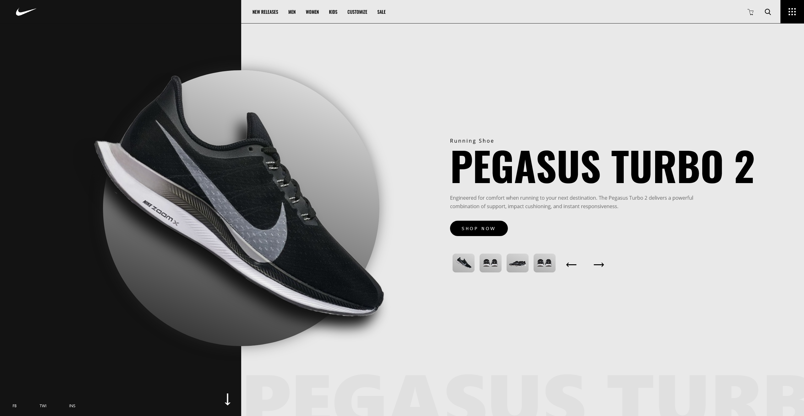

# Nike Landing Page Concept

This is a concept design for Nike's online store. The goal of this project was to begin learning ReactJS while turning a design file into an actual website. This project has a [demo](https://luisvilla.xyz/projects/nike/demo).
  
Visit my [personal website](https://luisvilla.xyz).

## Site

### Landing Page

## Setup

- This project requires [NodeJS](https://nodejs.org/en/).
- Clone the repository and run `npm i` or `npm install` to download all required modules.
- Once downloaded, run `npm run start`.
- The project should open at [http://localhost:3000](http://localhost:3000).

## Technologies Used

- Frontend
  - react - version 17.0.2,
